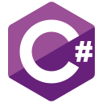

[Смотреть на Английском (EN)](README.md)

> **Эта страница недавно была изменена**  
> Если у Вас есть какие-либо вопросы или предложения, [сообщите мне](#связаться-со-мной-envelope) или [создайте issue](https://github.com/germanivanov0719/germanivanov0719/issues).

# Обо мне

Меня зовут Герман Иванов, я учусь в математическом классе в Москве. Я люблю программировать и принимать участие в олимпиадах по программированию.

## Образование :books:

- ### Лицей Академии Яндекса, 2020–2022
  Python, PyQt, Pygame, Flask

## Achievements :trophy:

- ### ВсОШ по Информатика (II этап), 2021–2022
  Сертификат: [281 9768-56587](certificates/VsOSh8th.pdf)
- ### ВсОШ по Информатика (II этап), 2020–2021
  Сертификат: [226 8144-44177](certificates/VsOSh7th.pdf)

## Лучшие проекты :computer:

- [Приложение Cryptography](https://github.com/germanivanov0719/Cryptography) (PyQt)
- [Racing](https://github.com/germanivanov0719/Racing) (Pygame)
- [Touch Typing Tutorial](https://github.com/germanivanov0719/touch-typing-tutorial) (PyQt)

Скоро будут добавленны и другие.

## Языки и Фреймворки (отсортированы по уровню знаний)

### Хороший уровень

### Средний уровень

### Минимальный уровень

## Связаться со мной :envelope:

- Почта: germanivanov0719@gmail.com
- Telegram: [@germanivanov0719](https://t.me/germanivanov0719)
